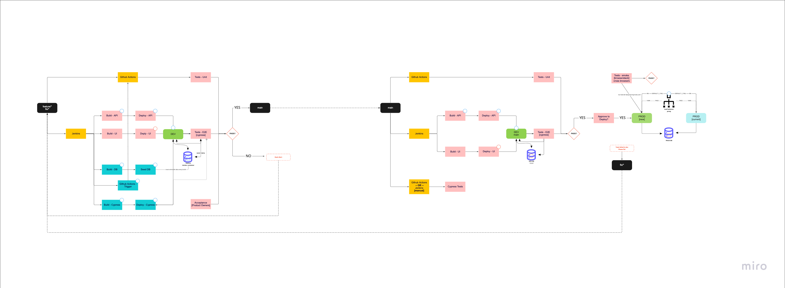

# Banksy

## Run:
```
- npm i
- npm run local:db
- npm run db:init
- npm run db:seed
- npm start
```

## API Routes
- `GET /:id/interests`
- `POST /:id/transactions`
   - request body example 1: 
   ```json
   {
      "amount": -5000,
      "createdAt": "2023-01-27"
   }
   ```
   - request body example 2 (without createdAt):
   ```json
   {
      "amount": 10000
   }
   ```


## Run API Routes
- postman: `bank-sy.postman_collection.json`


## Cases
1. Investor creates their first investment for $10.000 on January 1st.
   Expected result: Accrues $16.99 of interest on January, 31st.
   (31 days * 2% / 365 days in a year * $10.000 balance)
2. Investor creates their first investment for $10.000 on January 1st.
   On January 5, they add $5.000.
   Expected result: Accrues $24.38 of interest on January, 31st.
3. Investor creates their first investment for $10.000 on January 1st.
   On January 5, they withdraw $5.000.
   Expected result: Accrues $9.59 of interest on January, 31st.
4. Investor creates their first investment for $10.000 on January 1st.
   On January 15, they add $5.000.
   On January 27, they withdraw $5.000.
   Expected result: Accrues $20.27 of interest on January, 31st.


## Answers
`Today is 2023-01-31`

Scenario 1
```
31 * .02/365 * 10000 = $16.99
- Total: 16.99
```

Scenario 2
```
31 * .02/365 * 10000 = $16.99
27 * .02/365 * 5000 = $7.39
- Total: 24.38
```

Scenario 3
```
31 * .02/365 * 10000 = $16.99
27 * .02/365 * -5000 = $7.39
- Total: 24.38
```

Scenario 4
```
31 * .02/365 * 10000 = $16.99
12 * .02/365 * -5000 = -$3.28
12 * .02/365 * 5000 = $3.28
- Total: 20.27
```


## Arch

DB Diagram


CICD / DevOps

